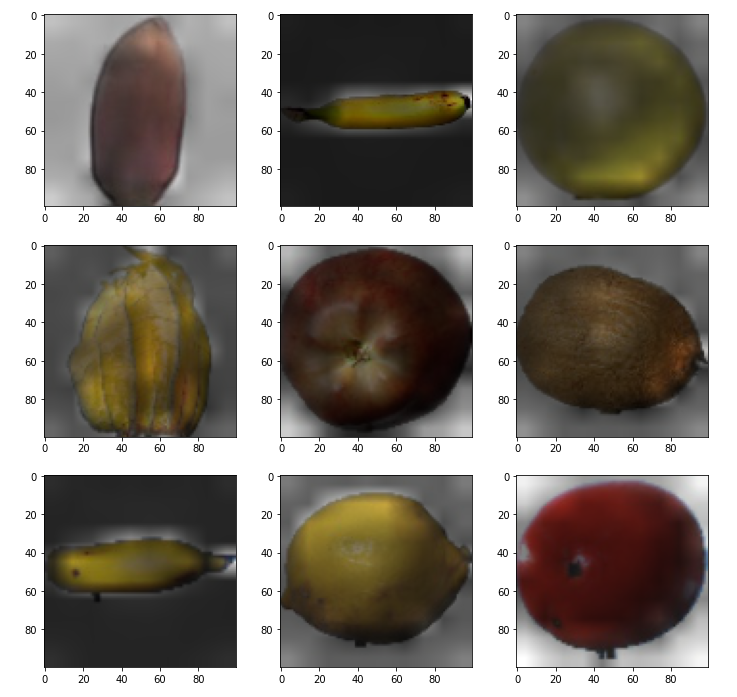

# Vision Transformer 

**Other Languages Available: [Rus](./README_RU.md)**

This repository will contain my implementation of [Vision Transformer](https://arxiv.org/pdf/2010.11929.pdf) in TensorFlow 2.

## Run the project
Before running project, build it with
```bash
docker build -t artembakhanov/vit .
```

If you want to to use (Fruits-360)[https://www.kaggle.com/moltean/fruits] dataset, please unpack it to ```datasets``` folder named ```fruits-360```.
Also do not forget to volume bind datasets folder to all your containers.

1. Run Jupyter Notebook:

   ```bash
   docker run --rm -it -v $(pwd)/datasets:/tf/datasets artembakhanov/vit
   ```
      

2. Run training process:

   1. mnist example:
   ```bash
   docker run --gpus all --rm -it -v $(pwd)/saved_models:/tf/saved_models -v $(pwd)/datasets:/tf/datasets -v $(pwd)/logs:/tf/logs -v $(pwd)/checkpoints:/tf/checkpoints  artembakhanov/vit python train.py --dataset mnist --dropout-rate 0.1 --batch-size 64 --base-lr 0.001 --end-lr 0.001 --checkpoints --epochs 15
   ```
   
   2. fruits-360 example:
   ```bash
   docker run --gpus all --rm -it -v $(pwd)/saved_models:/tf/saved_models -v $(pwd)/datasets:/tf/datasets -v $(pwd)/logs:/tf/logs -v $(pwd)/checkpoints:/tf/checkpoints  artembakhanov/vit python train.py --dataset fruits-360 --latent-dim 64 --patch-size 10 --heads-num 4 --mlp-dim 128 --encoders_num 4 --dropout-rate 0.1 --batch-size 64 --base-lr 0.001 --end-lr 0.001 --checkpoints --epochs 15
   ```
3. Help:
    ```bash
    docker run --rm -it artembakhanov/vit python train.py --help
    ```

This image is capable of running tensorflow operations on GPU.
If you need this add ```--gpus all``` flag to ```docker run```.
For example:
```bash
docker run --gpus all --rm -it -v $(pwd)/datasets:/tf/datasets artembakhanov/vit
```

Note that checkpoints are saved inside the container. You need to volume bind all the folders you need to preserve.

## Results

I trained it for 15 epochs and got about 97.55% accuracy on fruits-360 dataset and 97.67% on mnist.


### Attention map example



## Project structure

```
├──  checkpoints        - save checkpoints here
│
├── datasets            - datasets are stored here
│   └── fruits-360      - fruits-360 dataset here
│
├── layers              - model layers
│   ├── encoder.py
│   ├── mlphead.py
│   └── patches.py
│
├── logs 
│
├── models             
│   └── base.py
│
├── saved_models         - weights of pretrained models
│   ├── pretrained_fruits-360
│   └── pretrained_mnist
│
├── utils                - additional instruments
│   ├── attentions.py
│   ├── datasets.py
│   ├── inference.py
│   └── schedule.py
│
├── consts.py            - constants
│
├── train.py             - train script
│
├── attention_maps.ipynb - examples of attentions maps
│
├── inference_example.ipynb - example of inference

```


## References
* [Vision Transformer](https://arxiv.org/pdf/2010.11929.pdf)
